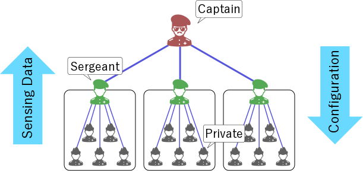

* 情報は少しずつ追加予定
* プログラムは現状ほぼ未完成


センシング部隊
============================================================
IoTデバイスでの大規模センシングを行うための基盤

グループごとでのデータの集計やセンシング設定の変更を柔軟にできることを目的とするもの


### 全体の概要図


プログラムについて
============================================================
### 外部ライブラリ
* flask
* requests

### 起動時パラメータ
Private, Sergeantは自身のAPI受付ポートと上官のIP/ポートを指定する必要がある

例:
```
$ python3 private.py 50000 localhost 51000  
$ python3 sergeant.py 51000 localhost 52000
```

Captainは自身のAPI受付ポートを指定できる。指定無しの場合はデフォルトの52000が使用される

例:
```
$ python3 captain.py 52000
```

### サンプル起動
それぞれのアクタを最低限（１つずつ）起動するスクリプト(`test/run_single.sh`)と  
Cpt:1, Sgt:4, Pvt:20(4\*5)を起動するスクリプト(`test/run.sh`)がある

現在、終了処理は無いので終了する際はpythonプロセスをkillする

例:
```
$ pkill python3
```

### WebUI
すべてのアクタの所属状態やデータを一覧できるWebUIがcaptainに実装されている

例:
```
http://localhost:52000/web/status
```

### APIテスト用コンフィグファイル
test/下にcurlコマンドで使えるconfファイルがあり、それぞれAPIのテストデータなどが入っている
```
$ curl --config test/pvt_order.conf
```
* sgt_cache.conf / cpt_cache.conf
  - Sergeant / Captainが受信したデータを表示する
* pvt_order.conf
  - Privateにセンシング命令を出すAPI
  - ランダム値を2秒ごと、ゼロ値を5秒ごとに送信する設定
* sgt_job_command.conf
  - Sergeantに指揮命令を出すAPI
  - 自身の下に所属するPrivateに対して指定された命令を出す
  - すべてのPrivateに、ランダム値を2秒ごとに送信する命令を出す設定
* sgt_job_report.conf
  - Sergeantにレポート命令を出すAPI
  - Privateから集めたデータを5秒ごとに送信する設定

